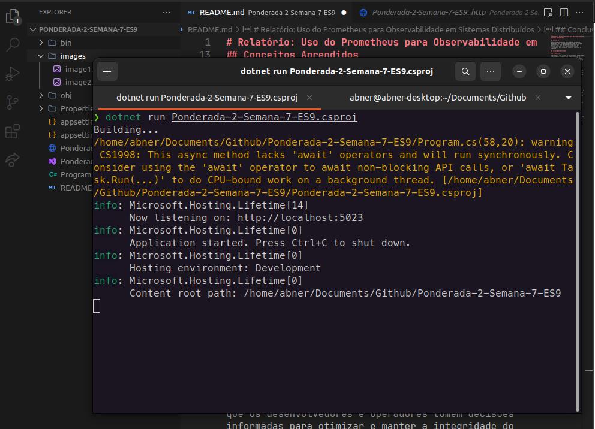
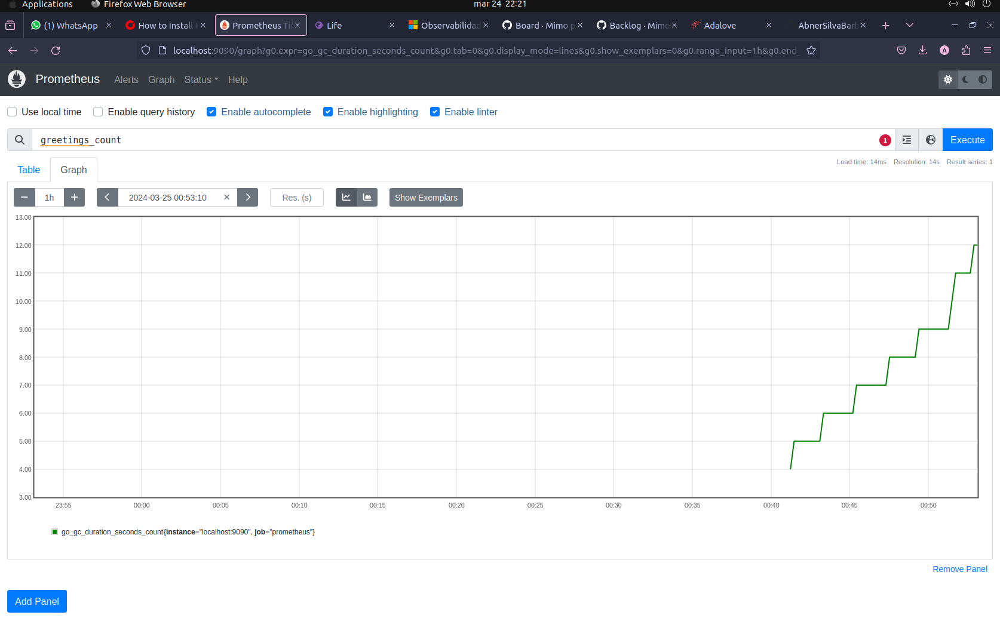

# Relatório: Uso do Prometheus para Observabilidade em Sistemas Distribuídos

## Introdução

Este relatório aborda a utilização da ferramenta Prometheus para alcançar observabilidade em sistemas distribuídos. Essa ferramenta é essenciais para coletar métricas, criar dashboards e realizar rastreamento distribuído em ambientes complexos de software.

## Tecnologias Utilizadas

### Prometheus

O Prometheus é um sistema de monitoramento e alerta de código aberto projetado para coletar métricas de sistemas distribuídos. Ele possui um modelo de dados multidimensional flexível e uma linguagem de consulta poderosa que permite visualizar e alertar sobre o estado dos seus aplicativos e serviços.

## Conceitos Aprendidos

### Observabilidade

A observabilidade refere-se à capacidade de compreender o comportamento interno de um sistema com base nos dados coletados de suas operações. Isso inclui métricas, logs e rastreamento distribuído, que fornecem insights valiosos sobre o desempenho, a confiabilidade e a eficiência do sistema como um todo.

### Coleta de Métricas

A coleta de métricas é fundamental para monitorar o desempenho e o estado de um sistema distribuído. O Prometheus é uma ferramenta poderosa para coletar e armazenar métricas em tempo real, permitindo que os operadores identifiquem e resolvam problemas rapidamente.

### Visualização de Métricas

A visualização de métricas é essencial para entender o comportamento de um sistema distribuído. O Grafana oferece uma variedade de opções de visualização, como gráficos de linha, barras e medidores, que ajudam os usuários a interpretar e analisar os dados de maneira intuitiva.

### Rastreamento Distribuído

O rastreamento distribuído é uma técnica para monitorar o fluxo de solicitações entre os diferentes componentes de um sistema distribuído. O Jaeger permite rastrear e analisar essas solicitações em detalhes, facilitando a identificação de gargalos, latências e falhas na arquitetura do sistema.

## Prints

 

## Conclusão

O uso do Prometheus proporciona uma solução abrangente para observabilidade em sistemas distribuídos. Essas ferramentas fornecem insights valiosos sobre o desempenho e a confiabilidade do sistema, permitindo que os desenvolvedores e operadores tomem decisões informadas para otimizar e manter a integridade do sistema.# Ponderada-2-Semana-7-ES9
